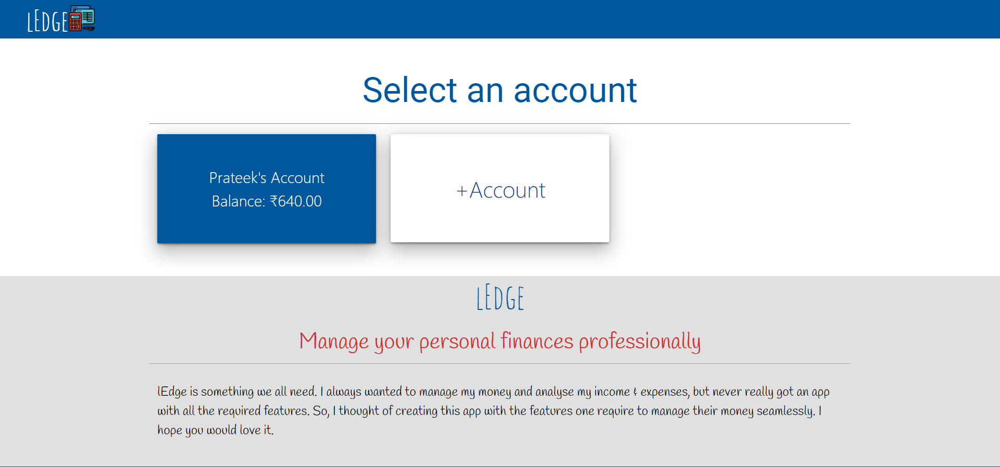
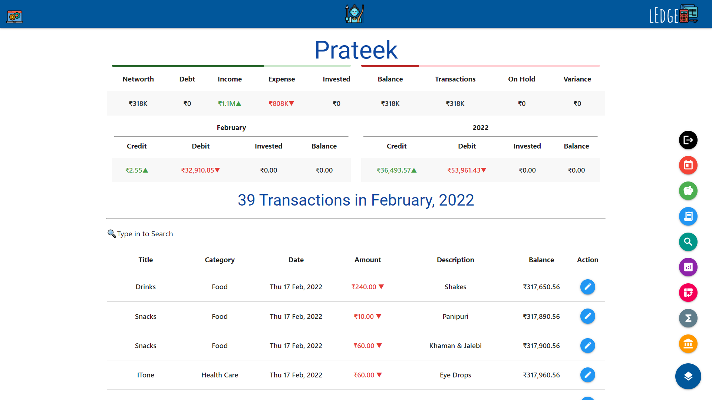
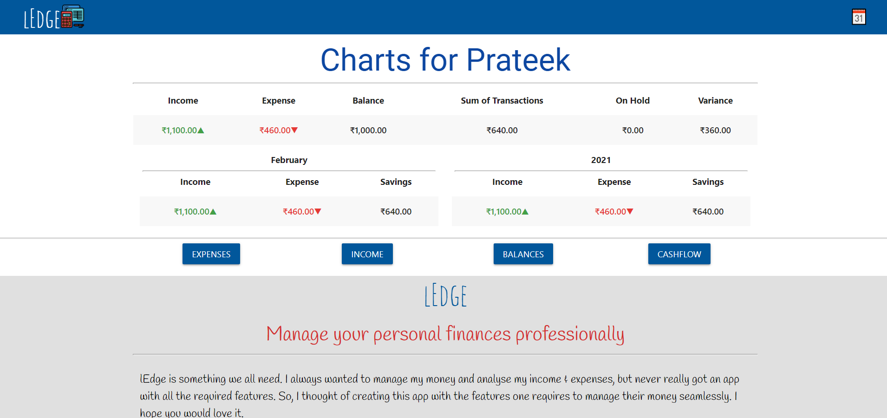
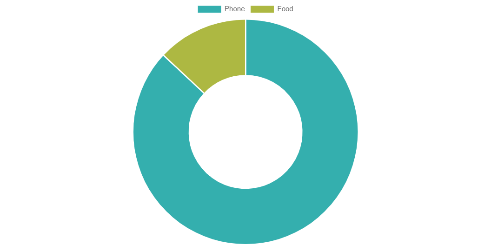
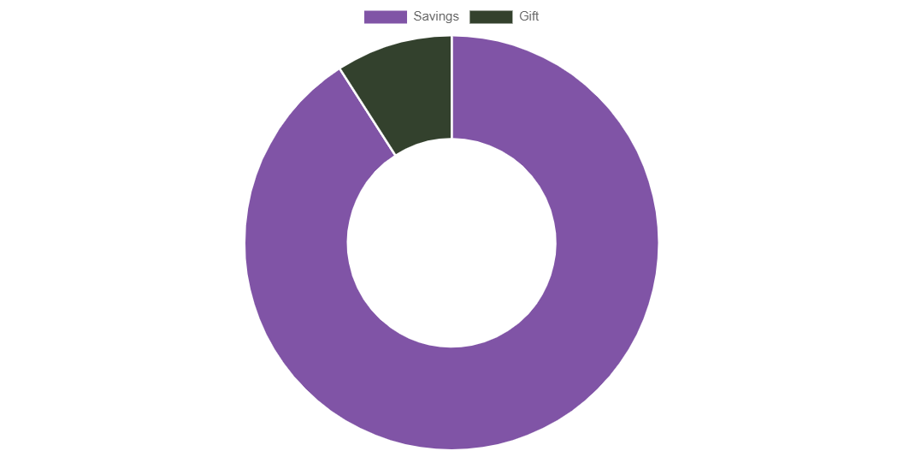
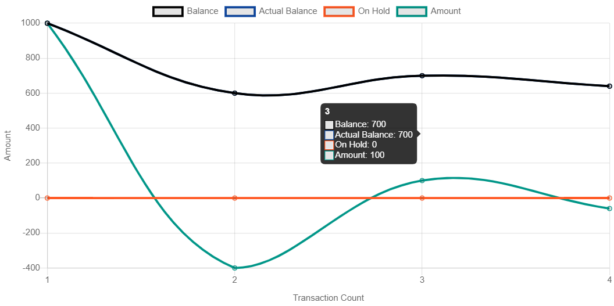
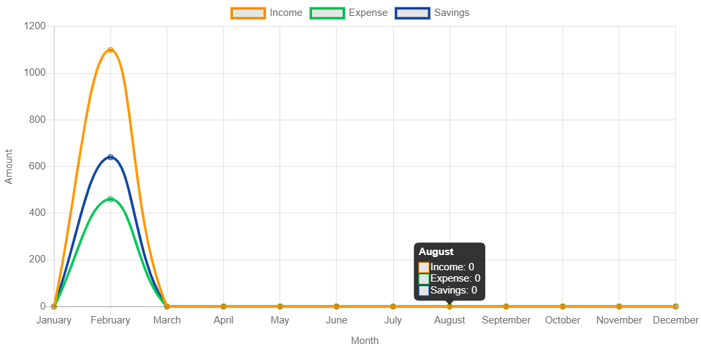
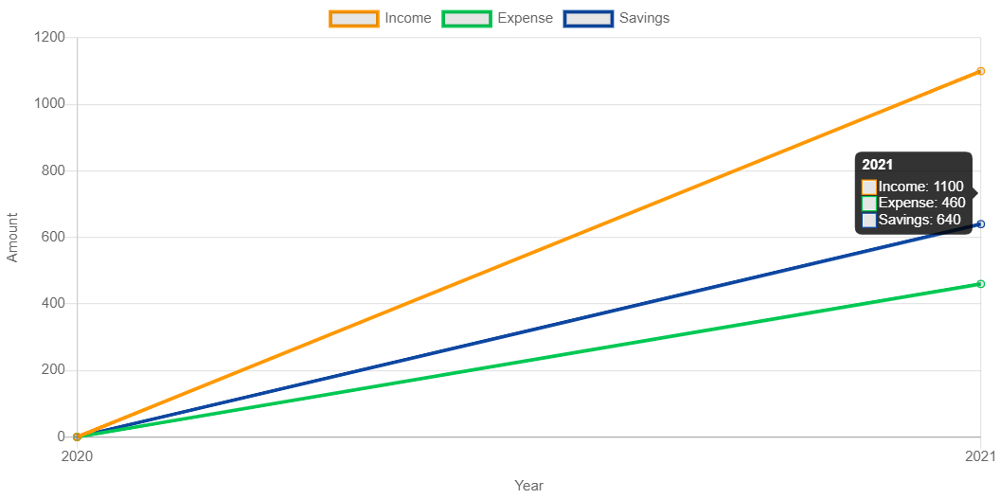
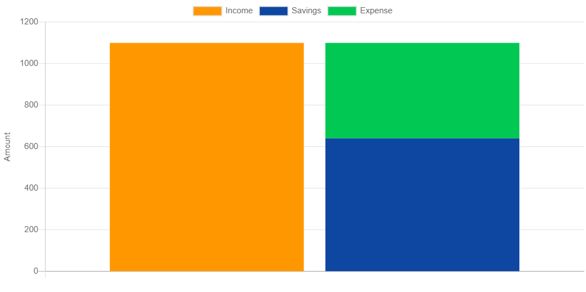

# lEdge
lEdge is something we all need. I always wanted to manage my money and analyse my income & expenses, but never really got an app with all the required features. So, I thought of creating this app with the features one requires to manage their money seamlessly. I hope you would love it.

Installation Guide:  
        1. Install Node-JS (https://nodejs.org/en/download/) and MongoDB (https://www.mongodb.com/try/download/community) 
        2. Clone the repository in your computer 
        3. Open Terminal in the current directory 
        4. Execute "install.bat" 
        5. Copy the shortcut provided at your preferred location (Desktop) 
        6. excute the shortcut/run_server.bat 
        7. Manage your finances seamlessly

Account lists

Transactions and Balances

Charts

Expenses

Income

Balances

Yearly Cashflow

Lifetime Cashflow

Cashflow Comparison

